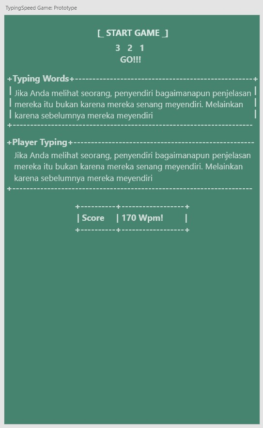

# **TypingSpeed Game** Project
this is a Typing Speed Game project using basic java

## **Run Program**
  **.jar** stored in the target folder
  ```bash
  java -jar TypingSpeed-Game.jar
  ```

## **Prototype Typing Speed Game**
Link prototype [download](https://xd.adobe.com/view/73b71280-4f5c-4d53-b2ff-1595edd712d6-26e4/)



<br>

## **Explanation Code**
  1. Data Model Typing Speed Game
      ```java
      public static final String[][] modelDataTypingWords = {
        {"Jika", "Anda melihat", "seorang", "penyendiri", "bagaimanapun penjelasan", "mereka..."},
        {"Aku", "sangat mengharapkan", "dia", "untuk", "menjadi kekasihku.", "Apakah dia mau..."},
        {"You Know,","they say","when","you talk to","God it's","prayer for you so pray..."},
        {"I admit that twice","two make","fours is","an excellent","thing,","but if we but"},
        {"Biarlah aku","pergi jangan","lagi","kau tangisi","semoga","pilihan mu yang bagus"},
        {"Not sure","if you know","this","But when we","frist me","I got so nervous I cool"},
      };
      ```
  2. Business Logic Typing Speed Game
      ```java
      public static void countDown() throws InterruptedException {
        System.out.println("\t\t\t [_ START GAME _]\n");

        Thread.sleep(1000);
        for (var countNumber = 3; countNumber >= 1; countNumber--) {
          if (countNumber == 3) System.out.print("\t\t\t");
          System.out.print(countNumber+"\t");
          Thread.sleep(1000);

          if (countNumber == 1) System.out.println("\n\t\t\t      GO!!!\n");
        }
      }


      public static int randomChooseTypingWords() {
        Random random = new Random();
        int rand = random.nextInt(6);

        return rand;
      }


      public static StringBuilder showModelDataTypingWords() {
        var randomNumber = randomChooseTypingWords();

        for (var rows = randomNumber; rows <= randomNumber; rows++) {
          for (var column = 0; column < 6; column++) {
            randomWords.append(modelDataTypingWords[rows][column]+" ");
          }
        }

        return randomWords;
      }


      public static String playerTypingWords() {
        return scan.nextLine();
      }


      public static int countWpm(double startTime, double endTime) {
        double elapseTime = endTime - startTime;
        double seconds = elapseTime / 1_000_000_000.0;
        /* Formula WPM ((length Character / 5) / minute) * 60 = wpm!  */
        int wpm = (int) ( (((double)randomWords.length() / 5) / seconds) * 60 );

        return wpm;
      }
      ```
  3. View Typing Speed Game
      ```java
      public static void viewMain() {
        try {
          /*Jalankan Count Down*/
          countDown();

          /*tampilkan random words*/
          var randomWords = showModelDataTypingWords();
          System.out.println("+Typing Words+------------------------------------------------------------+\n"+"|\t\t\t\t\t\t\t\t\t  |");
          System.out.println("| "+randomWords.toString()+" |");
          System.out.println("+-------------------------------------------------------------------------+");

          double startTime = LocalTime.now().toNanoOfDay();

          /*Player Typing*/
          viewPlayerTyping();

          double endTime = LocalTime.now().toNanoOfDay();
          /*hitung score wpm*/
          viewScoreWpm(startTime, endTime);

        } catch (InterruptedException e) {
          e.printStackTrace();
        }
      }


      public static void viewPlayerTyping() {
        System.out.println("\n+Player Typing+------------------------------------------------------------+\n");
        System.out.print(" "); playerTypingWords();
        System.out.println("+--------------------------------------------------------------------------+");
      }


      public static void viewScoreWpm(double startTime, double endTime) {
        System.out.println("\t\t\t+----------+------------+");
        System.out.println("\t\t\t| Score    | "+countWpm(startTime, endTime)+" Wpm!\t|");
        System.out.println("\t\t\t+----------+------------+");
      }
      ```

  4. Main Program
      ```java
      public static void main(String[] xxx) {
        viewMain();
      }
      ```
